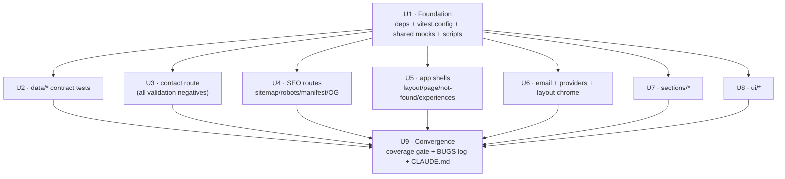

# test: Vitest Unit Test Suite (80% coverage, parallelizable) - Plan

Product Contract preservation: unchanged — enriched from `docs/brainstorms/2026-07-01-001-test-unit-test-suite-plan.md` with HOW only.

## Summary

Add a Vitest unit-test suite to a currently untested Next.js 16 / React 19 portfolio, reaching a hard-gated **80% coverage** (branches 70%) across the whole repo, with every unit isolated London/mockist style and no production source touched. Work is structured as **one foundation unit → 7 independent parallel units → one convergence unit**, so the bulk of the test-writing can proceed concurrently once the shared tooling and mock layer exist.

---

## Goal Capsule

- **Objective:** Executable regression safety net + enforced 80% coverage gate, built without modifying any `.ts/.tsx` in production.
- **Product authority:** Repo owner (M. Ulinuha). Conventions are owner-specified (see origin).
- **Open blockers:** None. Framework (Vitest), scope (global 80%), enforcement (hard gate), branch metric (70%), isolation (mockist), file location (co-located) all resolved in the brainstorm.

---

## Problem Frame

The repo has **zero test tooling and zero tests** (verified: no `vitest`/`jest`/`testing-library` in `package.json`; no `*.test.*`/`*.spec.*` files). No regression protection exists for the one piece of real server logic (`app/api/contact/route.ts`), the typed content contracts in `data/`, or the SEO route outputs. Content is data-driven and edited frequently, so a broken union value or malformed config can ship silently.

The plan installs a Vitest harness, a shared mock layer that lets every `"use client"` component render in jsdom without real Framer Motion / fonts / images / network, and co-located tests that drive coverage to the enforced threshold. Discovered production bugs are **documented and quarantined** (`it.skip` + `// BUG:`), never fixed here (source edits are out of scope).

---

## Requirements

Traceability back to the origin Product Contract (`R#` are plan-local labels for the origin's numbered in-scope items):

- **R1** — Tooling: `vitest`, `@vitest/coverage-v8`, `jsdom`, `@testing-library/react`, `@testing-library/jest-dom`, `@testing-library/user-event`; `vitest.config.ts` + setup file; `test` / `test:watch` / `coverage` scripts.
- **R2** — Global coverage gate: lines/statements/functions **≥ 80**, branches **≥ 70**, fail build below. Denominator excludes only non-source (config files, `*.d.ts`, setup, `public/`, `.next/`, `node_modules/`).
- **R3** — London/mockist isolation: mock `framer-motion`, `next/image`, `next-themes`, `next/font/google`, `next/navigation`, `next/og`, `resend`, global `fetch`.
- **R4** — Co-located `*.test.ts(x)` beside every source file in the coverage map.
- **R5** — Naming: `describe("<unit>") → describe("positive case" | "negative case" | "edge case") → it(...)`.
- **R6** — Negative tests cover **all** validation logic (contact route branches + `data/*` contract constraints).
- **R7** — BUGS protocol: real defect → `// BUG:` annotation + `it.skip`, logged in the Discovered Bugs table (this doc + origin).
- **R8** — Update root `CLAUDE.md` (Testing section) + `data/CLAUDE.md`, `app/api/CLAUDE.md`, `components/CLAUDE.md`.
- **R9** — Verify: `npm run test` green (bugs quarantined), `npm run coverage` meets thresholds.
- **R10** — Parallelizable task structure (owner's new ask for this plan): independent units executable concurrently after foundation.

---

## Key Technical Decisions

| # | Decision | Rationale |
|---|----------|-----------|
| KTD1 | **Vitest + v8 coverage + jsdom** | ESM-native, first-class with Next 16 / React 19; `vi.mock` fits mockist isolation. From origin. |
| KTD2 | **Single shared setup file** (`vitest.setup.ts`) owns all module mocks | One faithful pass-through per boundary (Framer Motion → DOM tags, `next/image` → ``, fonts → stub). Prevents mock drift across ~30 test files; every parallel unit inherits it. |
| KTD3 | **Fan-out unit topology** — U1 foundation blocks all; U2–U8 depend only on U1; U9 converges | Maximizes parallel throughput (R10). Only the setup layer is a shared write; test files never collide (co-located, disjoint paths). |
| KTD4 | **Branches 70%, others 80%** | Source edits forbidden → cannot silence unreachable defensive branches with `/* v8 ignore */`. 70% keeps the gate green while still strong. From origin. |
| KTD5 | **`next/og` + font/layout files are smoke-tested** | `ImageResponse` returns a binary image; assert it returns a `Response`/`ImageResponse` with correct size, not pixels. Render-smoke `layout`/`page` with fonts+providers mocked. |
| KTD6 | **Coverage config lives only in `vitest.config.ts`** (not in source) | Honors "no production-source edits" — excludes and thresholds are declared out-of-band, no in-file pragmas. |

---

## High-Level Technical Design

Unit dependency graph — the parallel fan-out (R10):



Shared mock layer (authored in U1, inherited by all):

```
vitest.setup.ts
 ├─ framer-motion      → motion.<tag> = passthrough DOM; AnimatePresence = fragment; hooks inert
 ├─ next/image         → plain 
 ├─ next-themes        → useTheme() stub + ThemeProvider passthrough
 ├─ next/font/google   → Geist/Geist_Mono → { variable, className }
 ├─ next/navigation    → useRouter/usePathname/useSearchParams stubs
 ├─ next/og            → ImageResponse mock (records size, returns Response)
 ├─ resend             → Resend class → { emails: { send: vi.fn() } }
 └─ global fetch       → vi.fn() (per-test resettable)
```

---

## Implementation Units

### U1. Test harness foundation + shared mock layer

- **Goal:** Everything needed for any other unit to run: dependencies, Vitest config with the coverage gate, the shared mock setup, and npm scripts.
- **Requirements:** R1, R2, R3, KTD1, KTD2, KTD6.
- **Dependencies:** none (critical path — blocks U2–U8).
- **Files:**
  - `package.json` (add devDeps + `test`, `test:watch`, `coverage` scripts)
  - `vitest.config.ts` (create)
  - `vitest.setup.ts` (create — shared mocks + `@testing-library/jest-dom`)
  - `tsconfig.json` (only if needed to include vitest globals types; prefer `vitest/globals` via config to avoid touching source config unnecessarily)
- **Approach:**
  - `vitest.config.ts`: `environment: 'jsdom'`, `globals: true`, `setupFiles: ['./vitest.setup.ts']`, coverage `{ provider: 'v8', reporter: ['text','html'], thresholds: { lines:80, statements:80, functions:80, branches:70 }, include: ['app/**','components/**','data/**'], exclude: ['**/*.d.ts','**/*.test.*','vitest.setup.ts','vitest.config.ts','next.config.ts','postcss.config.mjs','eslint.config.mjs','public/**','.next/**','node_modules/**'] }`. Resolve `@/*` → repo root (mirror `tsconfig.json` paths, via `vite-tsconfig-paths` or a manual alias).
  - `vitest.setup.ts`: register jest-dom; `vi.mock` each boundary from the mock-layer sketch. Keep pass-throughs faithful to the real prop surface (forward `className`, `children`, common handlers).
- **Patterns to follow:** `@/*` alias from `tsconfig.json`; data imported via `@/data` barrel (mocks must not break that).
- **Execution note:** Land this first and confirm `npm run test` runs (even with zero tests) before fanning out.
- **Test scenarios:** `Test expectation: none -- scaffolding/config unit. Validated indirectly by U2–U8 running green.`
- **Verification:** `npm run test` executes with no config errors; a trivial throwaway test can import a `"use client"` component (e.g. `SectionWrapper`) and render without Framer Motion/font errors.

### U2. `data/*` contract & integrity tests

- **Goal:** Assert every typed-content constraint holds — the negative-validation surface for data (R6).
- **Requirements:** R4, R5, R6.
- **Dependencies:** U1.
- **Files (co-located):** `data/config.test.ts`, `data/personal.test.ts`, `data/projects.test.ts`, `data/skills.test.ts`, `data/experience.test.ts`, `data/testimonials.test.ts`.
- **Approach:** Pure assertions over the exported arrays/objects; no mocks needed beyond U1. Group per exported unit with pos/neg/edge describes.
- **Patterns to follow:** union types in `data/projects.ts` (`status`, `category`) and `data/experience.ts` (`type`, `icon`); `projectCategories` id list.
- **Test scenarios:**
  - `projects` — positive: array non-empty, each item has title/description/image/tags. negative case: every `category` ∈ `projectCategories` ids; every `status` ∈ `{completed,in-progress,on-hold}`; `image` is a non-empty string; `github`/`live` (when present) look like URLs. edge: `tags` may be empty array; `featured` optional.
  - `experience` — negative case: every `type` ∈ `{education,work,achievement,organization}`; every `icon` ∈ `{graduation,briefcase,award,calendar,users}` (icons that map to lucide in `experience.tsx`); `period` non-empty.
  - `testimonials` — negative case: `rating` is integer 1–5; `content`/`name` non-empty. edge: `image` optional.
  - `config` — negative case: `siteConfig.url` parses as a URL; `keywords` non-empty; `homepage.experiencesLimit`/`projectsLimit` positive integers. edge: theme mode is `"dark"|"light"`.
  - `personal` — negative case: `email` matches an email shape; each `socialLinks` entry has a non-empty `href`; each `navItems` entry has label + href. edge: stats/funFacts arrays non-empty.
  - `skills` — negative case: every skill `level` in 0–100; `techStackRow1/2/3` non-empty.
- **Verification:** `npm run test data/` green; any constraint violation in current data surfaces as a failure (or a `// BUG:` skip per R7).

### U3. Contact API route tests (validation-complete)

- **Goal:** The primary negative-testing target — cover every branch of `app/api/contact/route.ts`.
- **Requirements:** R4, R5, R6, KTD3.
- **Dependencies:** U1.
- **Files:** `app/api/contact/route.test.ts`.
- **Approach:** Import the `POST` handler; construct `NextRequest`-like objects (or a stub with `.json()`); assert against the mocked `resend.emails.send` (from U1). Reset the Resend mock per test.
- **Patterns to follow:** `resend` mock in `vitest.setup.ts`; recipient from `personalInfo.email` (`@/data`).
- **Test scenarios:**
  - positive case: valid `{name,email,message}` → `emails.send` called once with `to: personalInfo.email`, `replyTo: email`, subject containing `name`, `react` set; response 200 `{success:true,data}`.
  - negative case (all validation branches): missing `name` → 400 `"All fields are required"`; missing `email` → 400; missing `message` → 400; empty-string `name` → 400 (falsy check); `resend.emails.send` resolves `{error}` → 500 `"Failed to send email"`; `request.json()` throws (malformed body) → 500 `"Internal server error"`.
  - edge case: whitespace-only `name`/`email`/`message` — current guard is `!field`, so `" "` passes validation. **If the intended contract is non-blank, this is a validation gap → mark `it.skip` with `// BUG: whitespace-only fields bypass required-field validation` (R7).** Also: extra unexpected fields ignored; very long message accepted.
- **Verification:** every branch of the handler executed; `npm run coverage app/api/contact` shows the route fully covered except any BUG-skipped branch.

### U4. SEO route tests

- **Goal:** Cover the metadata/route outputs and OG image generators.
- **Requirements:** R4, R5, KTD5.
- **Dependencies:** U1.
- **Files:** `app/sitemap.test.ts`, `app/robots.test.ts`, `app/manifest.test.ts`, `app/opengraph-image.test.tsx`, `app/twitter-image.test.tsx`.
- **Approach:** Call each default export; assert shape. For OG images, rely on the `next/og` mock (U1) and assert an `ImageResponse`/`Response` is returned with the configured `size` (1200×630).
- **Patterns to follow:** all read `siteConfig` (`@/data`); `manifest.ts` imports `@/data/config`.
- **Test scenarios:**
  - `sitemap` — positive: returns array of entries; each has `url` starting with `siteConfig.url`; includes `/` and `/experiences`. edge: `lastModified` present if the source sets it.
  - `robots` — positive: returns object with `rules` and `sitemap` pointing at `siteConfig.url`.
  - `manifest` — positive: `name`/`short_name`/`start_url`/`display` set; icons array non-empty. negative case: `start_url` is `/`.
  - `opengraph-image` / `twitter-image` — positive: returns a `Response`; `size` config is 1200×630; `contentType` is image. `Test note:` pixel content not asserted (KTD5).
- **Verification:** `npm run test app/` (SEO subset) green; OG routes counted as covered via smoke.

### U5. App shell render-smoke tests

- **Goal:** Cover composition/layout files that carry little logic but count toward global coverage.
- **Requirements:** R2, R4, KTD5.
- **Dependencies:** U1.
- **Files:** `app/layout.test.tsx`, `app/page.test.tsx`, `app/not-found.test.tsx`, `app/experiences/page.test.tsx`, `app/experiences/experiences-content.test.tsx`.
- **Approach:** Render with RTL; fonts/providers/Framer Motion mocked by U1. Assert key landmark content renders (e.g. a heading, nav, or section presence). For `layout`, assert children render inside the provider tree; for `experiences/page`, assert the JSON-LD `<script>` and delegated content component appear.
- **Patterns to follow:** server `page.tsx` → client `*-content.tsx` delegation (`app/experiences/`).
- **Test scenarios:**
  - `page` — positive: renders without throwing; contains the composed sections' anchors/ids (hero, about, projects…). edge: commented-out `TestimonialsSection` absent.
  - `layout` — positive: renders `children`; applies font variables/class; wraps in ThemeProvider (mock invoked). `Test expectation:` metadata export shape (title template) asserted as a plain object.
  - `not-found` — positive: renders 404 copy + a home link.
  - `experiences/page` — positive: renders breadcrumb JSON-LD script + `ExperiencesPageContent`.
  - `experiences-content` — positive: renders the experiences list from `experiences` data.
- **Verification:** `npm run test app/` shells green; layout/page counted covered.

### U6. Email template + providers + layout chrome

- **Goal:** Cover the non-section components: email JSX, theme provider, navbar, footer.
- **Requirements:** R4, R5.
- **Dependencies:** U1.
- **Files:** `components/email-templates/client.test.tsx`, `components/providers/theme-provider.test.tsx`, `components/layout/navbar.test.tsx`, `components/layout/footer.test.tsx`.
- **Approach:** RTL render with props. Email template is pure JSX (no directive) — render and assert interpolated fields. Navbar/footer read `navItems`/`socialLinks` (`@/data`).
- **Test scenarios:**
  - `ClientEmail` — positive: renders `clientName`, `clientEmail`, `message` into the markup. edge: empty `message` still renders structure; special chars not broken.
  - `theme-provider` — positive: renders children (next-themes mocked passthrough).
  - `navbar` — positive: renders a link per `navItems`; each `href` matches a section id/anchor; includes theme toggle. edge: mobile menu toggle state (if present) opens/closes via `user-event`.
  - `footer` — positive: renders a link per `socialLinks`; no "Made with" text (per recent commit). edge: current-year/copyright renders.
- **Verification:** `npm run test components/layout components/email-templates components/providers` green.

### U7. Homepage section tests

- **Goal:** Cover `components/sections/*`, including interactive behavior (contact form submit, projects filter).
- **Requirements:** R4, R5, R6, KTD3.
- **Dependencies:** U1.
- **Files (co-located):** `components/sections/hero.test.tsx`, `about.test.tsx`, `projects.test.tsx`, `skills.test.tsx`, `experience.test.tsx`, `testimonials.test.tsx`, `contact.test.tsx`.
- **Approach:** RTL render + `user-event`. Data comes from `@/data`; boundaries mocked by U1. For `contact`, mock global `fetch` and assert the POST payload + success/error UI states.
- **Test scenarios:**
  - `hero` — positive: renders name/role from `personalInfo`; CTA links present.
  - `about` — positive: renders bio + stats + whyHireMe items.
  - `projects` — positive: renders cards up to `homepage.projectsLimit`; edge: category filter switches visible cards; clicking a card opens `ProjectModal`; empty category shows appropriate state.
  - `skills` — positive: renders skill categories + marquee rows.
  - `experience` — positive: renders `experiencesLimit` items with correct icon mapping. negative case: an unknown `icon` string would fall through — assert current mapping only covers the allowed set (guards R6 union).
  - `testimonials` — positive: renders each testimonial + rating stars (1–5).
  - `contact` — positive: filling + submit calls `fetch('/api/contact', …)` with JSON body; shows success UI on 200. negative case: empty required fields blocked by the form (or server 400 surfaced); `fetch` rejects/500 → error UI shown. edge: submitting twice / disabled-while-sending.
- **Verification:** `npm run test components/sections` green; interactive branches (filter, submit success/error) covered.

### U8. UI primitive & effect tests

- **Goal:** Cover `components/ui/*` render-smoke + any branching (theme toggle, back-to-top visibility).
- **Requirements:** R2, R4, R5.
- **Dependencies:** U1.
- **Files (co-located):** `section-wrapper.test.tsx`, `bento-card.test.tsx`, `project-modal.test.tsx`, `marquee.test.tsx`, `animated-text.test.tsx`, `magnetic-button.test.tsx`, `preloader.test.tsx`, `scroll-progress.test.tsx`, `back-to-top.test.tsx`, `theme-toggle.test.tsx`, `dev-banner.test.tsx` (all under `components/ui/`).
- **Approach:** RTL render; Framer Motion mocked. Assert children/props render; drive the few real branches with `user-event` / mocked scroll or theme.
- **Test scenarios:**
  - `section-wrapper` — positive: renders children; forwards `id`/`className`.
  - `bento-card` — positive: renders children/content props.
  - `project-modal` — positive: renders passed project when open; edge: closed state renders nothing / close handler fires.
  - `marquee` — positive: renders provided items.
  - `animated-text` — positive: renders the text content.
  - `magnetic-button` — positive: renders children; edge: pointer move handler doesn't throw.
  - `preloader` — positive: renders; edge: hides after `animationConfig.preloaderDuration` (fake timers).
  - `scroll-progress` — positive: renders a progress element.
  - `back-to-top` — edge: hidden at top, visible after scroll threshold (mock scroll); click scrolls to top.
  - `theme-toggle` — positive: renders; edge: click calls `setTheme` (next-themes mock) toggling dark/light.
  - `dev-banner` — positive: renders banner content.
- **Verification:** `npm run test components/ui` green.

### U9. Convergence — coverage gate, BUGS log, docs

- **Goal:** Close the loop: enforce the gate, finalize the bug log, document testing.
- **Requirements:** R2, R7, R8, R9.
- **Dependencies:** U1–U8 (all).
- **Files:** `docs/plans/2026-07-01-001-test-unit-test-suite-plan.md` (Discovered Bugs table), `docs/brainstorms/2026-07-01-001-test-unit-test-suite-plan.md` (mirror bug log), `CLAUDE.md`, `data/CLAUDE.md`, `app/api/CLAUDE.md`, `components/CLAUDE.md`. Possibly small additional co-located tests to close residual gaps.
- **Approach:** Run `npm run coverage`; inspect the report; add targeted tests only where a source file sits below threshold. Record every `it.skip`+`// BUG:` in the Discovered Bugs table. Add a Testing section to the named `CLAUDE.md` files (how to run, conventions, mock layer location, BUGS protocol).
- **Execution note:** This unit runs last because the coverage denominator is only meaningful once all test files exist.
- **Test scenarios:** `Test expectation: none -- verification/documentation unit. Its output is the passing coverage gate itself.`
- **Verification:** `npm run coverage` meets lines/statements/functions ≥ 80, branches ≥ 70; `npm run test` green with all bugs quarantined; the four `CLAUDE.md` files describe the suite.

---

## Scope Boundaries

**In scope:** everything in Requirements R1–R10.

**Out of scope (non-goals):**
- Any edit to production `.ts/.tsx` (including `/* v8 ignore */` pragmas).
- E2E, integration-across-process, visual-regression, a11y-audit testing.
- CI/CD wiring beyond local npm scripts.
- Refactoring source "to be more testable."

### Deferred to Follow-Up Work
- Wiring `npm run coverage` into a CI workflow (`.github/workflows/`) — natural next step, but no CI exists in-repo today.
- Fixing any bug quarantined under R7 (requires a source-editing task the owner must authorize separately).

---

## Verification Contract

- `npm run test` exits 0 with every discovered bug isolated via `it.skip` + `// BUG:`.
- `npm run coverage` meets the gate: lines/statements/functions ≥ 80, branches ≥ 70.
- Every validation branch in `app/api/contact/route.ts` has a matching negative-case test (or a documented BUG skip).
- Each `data/*` union/range constraint has an integrity assertion.
- Root + `data/` + `app/api/` + `components/` `CLAUDE.md` document the suite.

---

## Discovered Bugs

Found during execution and quarantined per R7 (source not modified).

| ID | File:Line | Symptom | Test (skipped) |
|----|-----------|---------|----------------|
| BUG-1 | `app/api/contact/route.ts:13` | The required-field guard uses `!field`, so whitespace-only values (`"   "`) are truthy and bypass validation — a blank message still sends an email. | `app/api/contact/route.test.ts` → "edge case › rejects whitespace-only fields" (`it.skip`) |

**Update (2026-07-04):** BUG-1 fixed — the route now trims string fields (and rejects non-string fields) before the required-field check. The quarantined test is un-skipped and passing.

**Coverage achieved:** statements 94.13%, branches 83.6%, functions 90.99%, lines 94.87% (gate: 80/80/80 + branches 70). 121 tests pass, 1 skipped (BUG-1).

---

## Risks & Dependencies

- **Global 80% is effort-heavy** on ~20 presentational components — mitigated by the shared mock layer (KTD2) and render-smoke helpers; parallel fan-out (KTD3) spreads the load.
- **Branch coverage under no-source-edit** — some defensive `catch` branches may be unreachable; mitigated by the 70% branch threshold (KTD4) and by mocking Resend/`fetch` to throw.
- **Mock fidelity** — pass-through mocks for `framer-motion`/`next/image` must match the real prop surface or tests give false confidence; centralized in U1 to keep them faithful and reviewable in one place.
- **Alias resolution** — `@/*` must resolve in Vitest identically to `tsconfig.json`; validated in U1 before fan-out.
- **Dependency:** U2–U8 must not start until U1's setup is merged/available (shared mock layer is a hard prerequisite).

---

## Definition of Done

- All 9 units complete; U2–U8 were executable in parallel against U1.
- Verification Contract fully satisfied.
- `docs/` bug log and `CLAUDE.md` testing docs updated.
- No production `.ts/.tsx` modified (git diff of source files is empty aside from `package.json` devDeps/scripts and new test/config files).

---

## Sources & Research

- Origin requirements: `docs/brainstorms/2026-07-01-001-test-unit-test-suite-plan.md`.
- Repo facts verified directly this session: no test deps/files present; `app/api/contact/route.ts` validation shape; `data/*` union types; `@/*` alias in `tsconfig.json`; `next/og` usage in `app/opengraph-image.tsx`; server→client delegation in `app/experiences/`.
- No external research required — stack patterns (Vitest + RTL on Next 16 / React 19) are settled and the origin fixed all tool choices.
